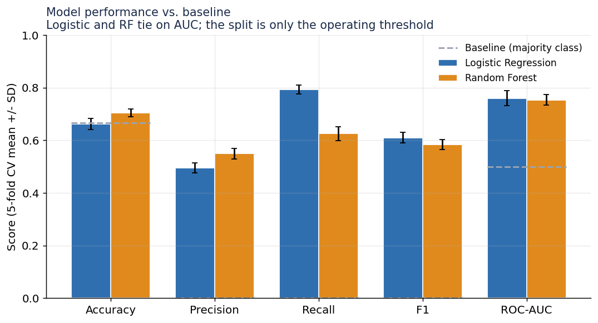
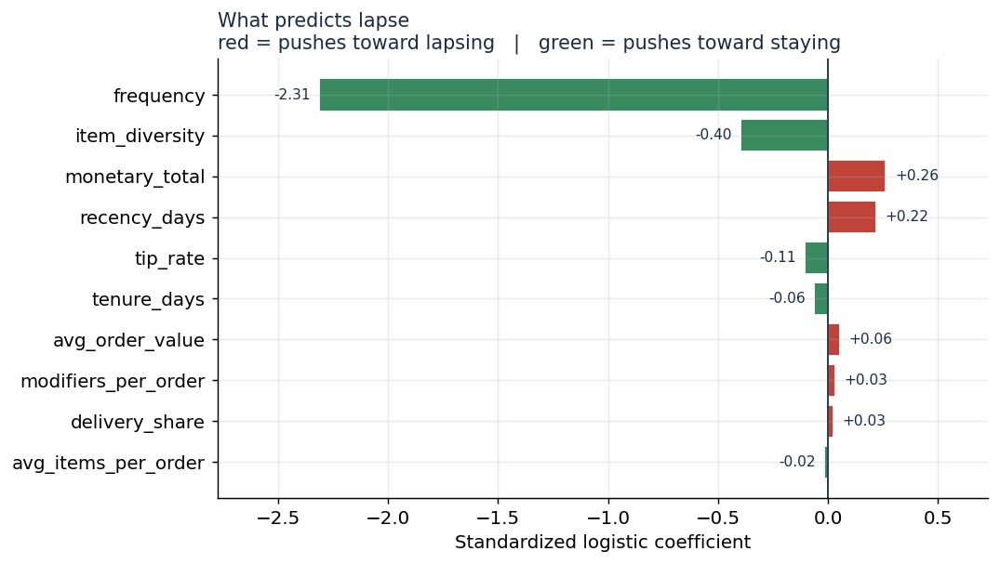
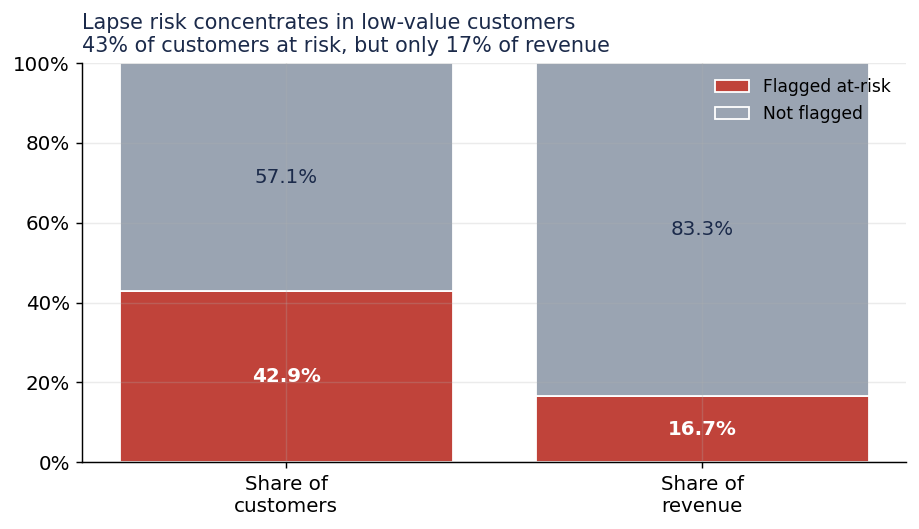
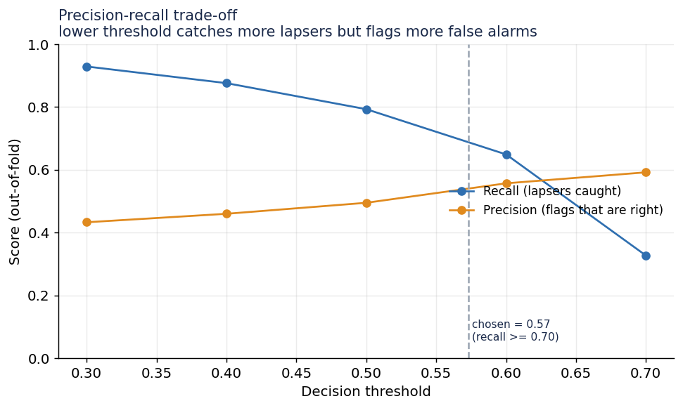

# Predicting Customer Lapse from Restaurant POS Data

A leakage-safe, cross-validated model that flags established customers at risk of
lapsing, built from 16 months of point-of-sale transaction data (~98k orders)
extracted from operational PDF reports.

The emphasis of this project is **methodological rigor on messy real-world data**,
not a headline accuracy number: careful target definition, strict leakage
prevention, honest evaluation under a small/imbalanced sample, and translation of
model output into a business decision.

## Problem

Frame: among **established, still-active** customers, who goes quiet? The target
is deliberately restricted (2+ orders in the feature window *and* activity in its
final quarter) to avoid the trivial case of "predicting" customers who had
already drifted away before the prediction window began.

- **Feature window:** 2025-03-01 to 2026-03-01 (12 months)
- **Prediction window:** 2026-03-01 to 2026-06-30 (4 months)
- **Lapsed = 1:** zero orders in the prediction window
- **Cohort:** 1,773 customers, 33.3% lapse rate

## Data cleaning

The raw data came from parsed PDFs and required real cleanup before modeling:

- **Placeholder customers excluded** — guest/walk-in IDs were absorbing thousands
  of unattributed orders and inflated order-weighted metrics into implausible
  ranges; filtered via `is_placeholder = 0`.
- **Adjustment lines separated** — discount/deal line-items carry no quantity
  (`is_adjustment = 1`, `quantity IS NULL`) and are excluded from item counts.
- **Global order key reconstructed** — `order_number` resets per report, so
  `order_id` is the only reliable key.

## Leakage prevention

- Every feature is computed **only** from the 12-month feature window.
- Customer-level aggregates are **rebuilt from raw orders**, not taken from the
  database's precomputed lifetime totals (which span the full period and would
  leak the outcome).
- Fan-out avoided: order-level money, item counts, and modifiers are aggregated
  in **separate CTEs at their correct grain**, then joined — so per-order values
  (`total`, `tips`) are never multiplied by line-item counts.

## Method

- **Models:** Logistic Regression (primary, interpretable) with a Random Forest
  as a comparison. Both `class_weight="balanced"` for the 33% positive rate.
- **Evaluation:** stratified 5-fold cross-validation, reporting mean +/- SD.
  With a modest sample, a single train/test split is too noisy to trust; the
  spread across folds is the honest measure of uncertainty.
- **Threshold:** a deliberate business choice (see `RECALL_TARGET`), not the
  arbitrary 0.5.

## Results

| Model | Accuracy | Precision | Recall | F1 | ROC-AUC |
|---|---|---|---|---|---|
| Baseline (majority) | 0.667 | 0.000 | 0.000 | 0.000 | 0.500 |
| Logistic Regression | 0.662 | 0.495 | 0.793 | 0.610 | **0.760 +/- 0.03** |
| Random Forest | 0.704 | 0.549 | 0.625 | 0.584 | 0.753 +/- 0.02 |



The two models **tie on AUC** — the flexible model gave no reliable ranking lift,
consistent with a small sample and largely linear structure, so the interpretable
logistic model was kept. Their apparent accuracy/precision/recall differences are
just different operating points on the same signal.

### What predicts lapse



Frequency and recency dominate (less frequent, less recent -> more lapse); the
frequency effect is strong but partly mechanical given the target. The more
interesting signal is **item diversity** — customers who tried a wider range of
the menu were meaningfully stickier.

### The key business finding



Translating predictions into dollars flips the naive story: the at-risk group is
**~43% of customers but only ~17% of revenue.** Lapse risk concentrates in
low-value customers, so retention spend should be **triaged toward the stable
high-value base**, not applied across the whole flagged list.

### Operating threshold



Lower thresholds catch more lapsers at the cost of more false alarms. Given that
at-risk customers are low-value, a higher-precision operating point is defensible;
the choice is a business decision, not a modeling default.

## Limitations

- **Single seasonal cycle.** 16 months cannot separate true lapse from a seasonal
  lull in the Mar–Jun prediction window.
- **Correlational, not causal.** The model describes who lapses, not what causes
  it; establishing a retention effect would require an experiment.
- **Modest sample.** ~1,773 customers means wide confidence intervals; this is a
  sound methodology demonstration, not a production-grade predictor.

## Repo layout

```
lapse_features.sql   # builds the modeling table (MySQL 8+), leakage-safe
lapse_model.py       # cross-validated training, evaluation, threshold, $ framing
make_plots.py        # regenerates the figures
figures/             # output charts
```

## Running it

```bash
# 1. run lapse_features.sql against MySQL 8+, export the full result to features.csv
# 2.
pip install pandas numpy scikit-learn matplotlib
python lapse_model.py features.csv
python make_plots.py
```
